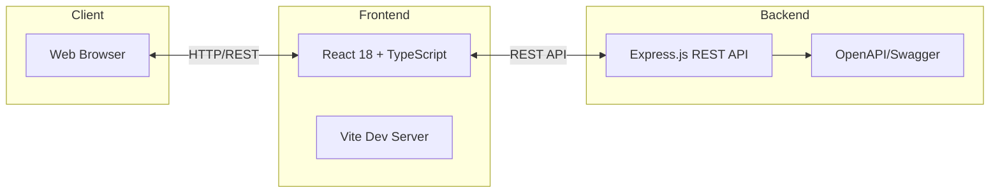
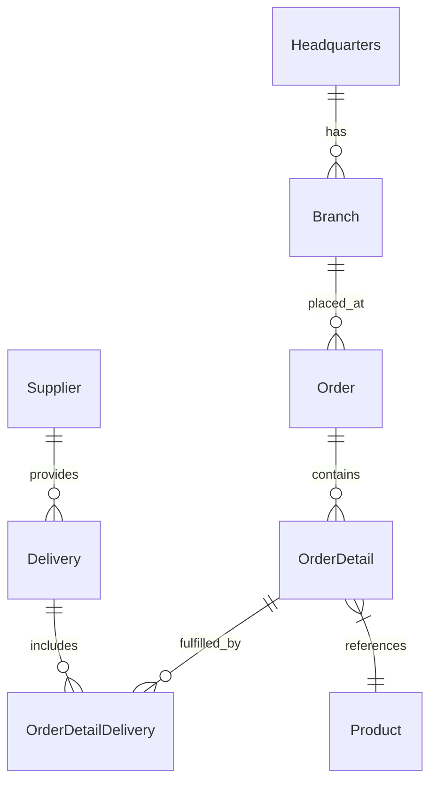

# OctoCAT Supply Chain Management System - Architecture

## Overview

OctoCAT Supply is a modern supply chain management application demonstrating GitHub Copilot capabilities. Built entirely with TypeScript using natural language prompts and Copilot, the system showcases AI-assisted development across backend, frontend, and infrastructure components.

**Tech Stack:** Node.js 18+, TypeScript, Express.js, React 18, Vite, Tailwind CSS, Docker

## System Architecture

### High-Level Architecture

### Data Model (ERD)

## Backend Architecture

**Technology:** Express.js, TypeScript, Swagger/OpenAPI

**Structure:**
- **API Layer** (`/api/src/index.ts`): Express application with CORS configuration, Swagger documentation
- **Routes** (`/api/src/routes/`): RESTful endpoints for each entity (Branch, Delivery, Headquarters, Order, OrderDetail, OrderDetailDelivery, Product, Supplier)
- **Models** (`/api/src/models/`): TypeScript entity definitions matching ERD
- **Documentation**: Auto-generated OpenAPI/Swagger spec accessible at `/api-docs`

**Key Features:**
- RESTful API design with full CRUD operations
- CORS support for local development and GitHub Codespaces
- Environment-based configuration (`PORT`, `API_CORS_ORIGINS`)
- Comprehensive test coverage using Vitest
- Seed data for demo scenarios

**Build & Test:**
- Build: `npm run build --workspace=api` (TypeScript → JavaScript)
- Dev: `npm run dev --workspace=api` (tsx hot reload)
- Test: `npm run test --workspace=api` (Vitest with coverage)

## Frontend Architecture

**Technology:** React 18, TypeScript, Vite, Tailwind CSS, React Router, Axios

**Structure:**
- **Components** (`/frontend/src/components/`):
  - Core: Navigation, Footer, Welcome, About, Login
  - Admin: AdminProducts
  - Entity-specific: Product management (ProductForm, Products)
- **Context** (`/frontend/src/context/`): AuthContext, ThemeContext for state management
- **API Integration** (`/frontend/src/api/`): Axios-based API client configuration
- **Routing**: React Router for SPA navigation
- **Styling**: Tailwind CSS with custom theme support

**Key Features:**
- Responsive UI with Tailwind CSS
- Context-based state management (Auth, Theme)
- Product catalog and administration
- Dark/light theme support
- Carousel for product showcases (react-slick)

**Build & Dev:**
- Build: `npm run build --workspace=frontend` (TypeScript + Vite)
- Dev: `npm run dev --workspace=frontend` (Vite HMR on port 5137)
- Lint: `npm run lint --workspace=frontend` (ESLint)

## Deployment & DevOps

**Containerization:**
- Docker support with Dockerfiles for both API and frontend
- Nginx configuration for frontend static serving
- Environment-based configuration for flexible deployment

**Monorepo Structure:**
- npm workspaces for multi-package management
- Concurrent development mode: `npm run dev` (runs both API and frontend)
- Unified scripts for build, test, and development

**Infrastructure:**
- Deployment scripts in `/infra/configure-deployment.sh`
- Supports GitHub Codespaces with auto-configured CORS
- Production-ready with environment variable configuration

## Development Workflow

1. **Install**: `npm install` (installs all workspace dependencies)
2. **Development**: `npm run dev` (starts API on :3000, frontend on :5137)
3. **Build**: `npm run build` (builds both workspaces)
4. **Test**: `npm test` (runs tests for all workspaces)

## Key Design Decisions

- **Monorepo**: Simplifies dependency management and coordinated changes
- **TypeScript**: Type safety across frontend and backend
- **Vite**: Fast builds and HMR for optimal DX
- **Context API**: Lightweight state management without external dependencies
- **REST**: Simple, well-understood API pattern
- **OpenAPI**: Self-documenting API with Swagger UI
- **Workspace Pattern**: Clear separation of concerns between API and frontend