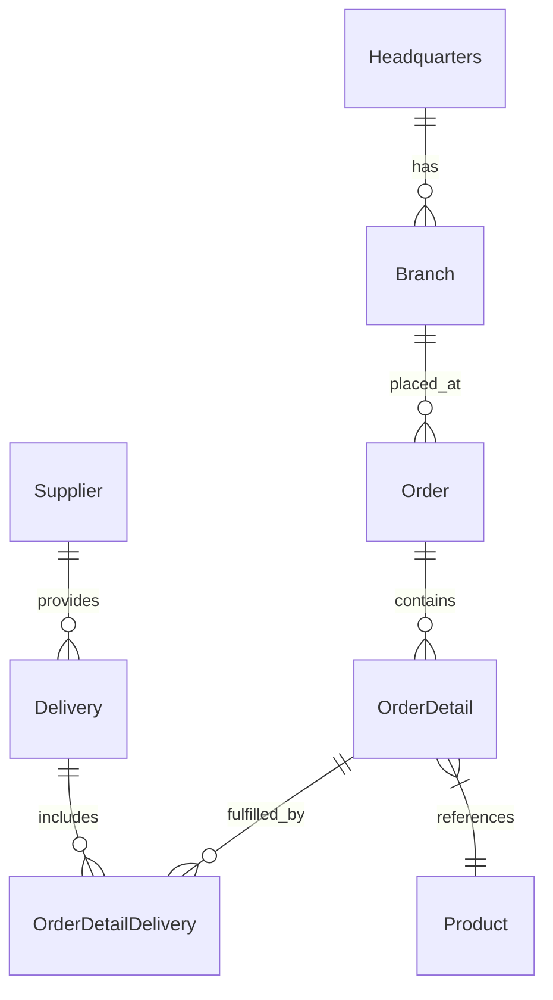

# 🚀 OctoCAT Supply: The Ultimate GitHub Copilot Hands-On Demo v2.0


Welcome to the OctoCAT Supply Website - your go-to demo for showcasing the incredible capabilities of GitHub Copilot, GHAS, and the power of AI-assisted development!

## ✨ What Makes This Demo Special

This isn't just another demo app - it's a carefully crafted showcase that demonstrates the full spectrum of GitHub's AI capabilities:

- 🤖 **Copilot Agent Mode & Vision** - Watch Copilot understand UI designs and implement complex features across multiple files
- 🎭 **MCP Server Integration** - Demonstrate extended capabilities with Playwright for testing and GitHub API integration
- 🧪 **Test Generation** - Exhibit Copilot's ability to analyze coverage and generate meaningful tests
- 🔄 **CI/CD & IaC** - Generate deployment workflows and infrastructure code with natural language
- 🎯 **Custom Instructions** - Show how Copilot can be tailored to understand internal frameworks and standards
- 📜 **Custom Prompt Files** - Automate repetitive tasks and documentation updates with ease

---

## 💻 Hands-On Scenarios

#### Note if you plan to use the FREE version of GitHub Copilot, please perform all activities in your local IDE with one of the included models ####

1. **GUIDED HANDS-ON: Create Custom Instructions and a Custom Prompt File**
   This activity will be performed together as a group.
   - Use GitHub Copilot Ask Mode and Agent to ask Copilot about the API of the project or any other question about your repo and run the project to see it live.
      - Sample Prompt: `Please give me details about the API of this project.`
      - Sample Prompt: `Are there any core features missing in my project?`
   - Use Agent mode to have GitHub Copilot build and deploy the existing implementation of the Supply Chain store.
      - Sample Prompt: `Please build and run my project so that I can see its existing state.`
         - Review the existing store. 
   - Use GitHub Copilot to update or create the custom instructions for the OctoCAT Supply project.
      - Use the `Gear` icon in the GitHub Copilot Chat window to select the `Generate Agent Instructions`  prompt. 
         - Create a generic (project wide) GitHub Copilot Instructions file.
            - Hint: This file should be in the base directory of the `.github` folder and have the name `copilot-instructions.md`.
         - Create an API specific GitHub Copilot Instructions file using the same process as before.
            - Hint: This file should be in the `.github/instructions` directory and have a name that resembles `API.instructions.md`
            - Sample Prompt: `Please create an API Specific custom instructions set and save in  #API.instructions.md `
   - Ask GitHub Copilot questions about your project and discover the use of the `Custom Instructions` files that have been created. 
      - How does your response compare to before?
   - Review Existing GitHub Copilot Prompt files to learn about how they can help speed up your workflow.  Execute one if you'd like.
---
2. **GUIDED HANDS-ON: Review a Custom Agent (Chat Mode) and how to creat one**
   This activity will be performed together as a group.
   - Review the Copilot Custom Agent (Chat Mode) in the `.github/agents`.
   - Create a Custom Agent (Chat Mode) for the OctoCAT Supply project if you would like. 
---
3. **Requirements Specifications and Agentic Implementation** 
   - Use previously reviewed `custom agent` to define features and create an implementation plan
      - Use the /docs/design/MonaFigurine.png file (found in ./docs/design) to create a new product offering on the website.
          - Sample Prompt: `Using the image #file:MonaFigurine.png file, create an a new product offering to the OctoCAT Supply website.  Price is $32.99, SKU is MONA-001, and description is "A beautiful handcrafted figurine inspired by the Mona Lisa."`
      - Generate UI components from design mockups (using Copilot Vision) and Generated Implementation Plan.
      - Review the Pull Request in your Repo that was created by Copilot Agent Mode and merge the one you like best.
   - Use GitHub Copilot Agent mode to the Create Cart Page and Cart Icon.
      - Syncronize your branch with the latest main branch.
      - Start a New Chat using Agent Mode.  Select the Claude Sonnet 4 model or any other model that supports Agent Mode.
      - Drag the cart.png file (found in ./docs/design) into the chat window.
      - Ask Copilot to implement the a simple cart icon and cart page that displays the items in the cart.

---
4. **Test Generation and Coverage Improvement**
   - Analyze existing test coverage using `Ask` Mode. 
       - Sample Prompt:  `Please analyze my current test coverage and identify any missing test cases.`
   - Generate unit and integration tests with Copilot
      - Hint: Use the "unit test coverage" prompt to generate unit tests for the Product and Supplier routes.
   - Improve coverage based on analysis
   - BONUS: Ask GitHub Copilot to execute the tests using the Playwright MCP server.
---
5. **Documentation Update**
   - Use GitHub Copilot Internal Prompting to create a custom prompt file for the OctoCAT Supply project to update all existing documentation for the project.
       - Hint: Use the "Prompt Files" prompt to create a custom prompt file for the OctoCAT Supply project.
       - Sample Prompt: `Complete the prompt file to update the documentation of this project or the specified file mentioned by the user.  Only update the prompt file, do not update any documentation.`
    - Execute the custom prompt file to update all existing documentation for the project.
        - Hint: Use the slash command to execute the prompt all existing documentation for the project.  Specify the README.md file and the docs/architecture.md file if you only want that updated. 

---
6. **Frontend Design review (using agent skills)**
   - Review the [`.github/skills/web-design-reviewer/SKILL.md`](./.github/skills/web-design-reviewer/SKILL.md) file. This file provides an agent skill for improving frontend design quality.
   - Ensure that the `chat.useAgentSkills` setting is enabled in VS Code:
      - Open Settings (`Ctrl + ,`) and search for `chat.useAgentSkills`.
   - Start the application locally and ask GitHub Copilot to review your frontend design:
      - Sample Prompt: `Find design problems of the application running on http://localhost:5173`
   - BONUS: Ask GitHub Copilot to fix the design problems it identified.
      - Sample Prompt: `Fix the design problems you found in the frontend.`
---

## 🏗️ Architecture

The application is built using modern TypeScript with a clean separation of concerns:



### Tech Stack
- **Frontend**: React 18+, TypeScript, Tailwind CSS, Vite
- **Backend**: Express.js, TypeScript, OpenAPI/Swagger
- **DevOps**: Docker

---

## 🚀 Getting Started

1. Clone this repository
2. Build the projects:
   ```bash
   # Build API and Frontend
   npm install && npm run build
   ```
3. Start the application:
   ```bash
   npm run dev
   ```

Or use the VS Code tasks:
- `Cmd/Ctrl + Shift + P` -> `Run Task` -> `Build All`
- Use the Debug panel to run `Start API & Frontend`

### Tests and coverage

Run `npm test` for both nonwatch suites, or `npm run test:coverage --workspaces` to enforce coverage. The API gate covers all route handlers; the frontend gate covers API configuration, auth and theme contexts, login, catalog, product form, and admin product management. Both require at least 85% statements, lines and functions, and 80% branches. CI also runs both builds and frontend lint.

After `npm install`, Husky installs a pre-push hook that runs the same coverage gate. A failed test or unmet threshold blocks the push; GitHub Actions runs the gate again on push and pull request. Run `npm run prepare` to reinstall the hook in an existing checkout. Set `HUSKY=0` for a one-off push without local hooks when necessary; CI remains the required gate.

## 🛠️ MCP Server Setup (Optional)

Use VS Code command palette:
   - `MCP: List servers` -> `playwright` -> `Start server`

## 📚 Documentation

- [Detailed Architecture](./docs/architecture.md)
- [Build Instructions](./docs/build.md)

---

## 🙌 Acknowledgements
** GitHub Universe 2025 Demo Contributors:  Dustin Ellis (@ellisd4), Harald Kirschner (@digitarald), Joel Norman (@microsoftnorman)

** GitHub Universe 2025 Demo Testers: Tina Saulsberry (@Snuckles2)


*This entire project, including the hero image, was created using AI and GitHub Copilot! Even this README was generated by Copilot using the project documentation.* 🤖✨
